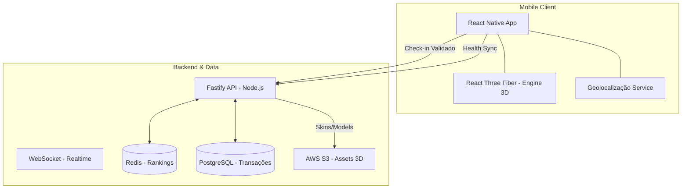
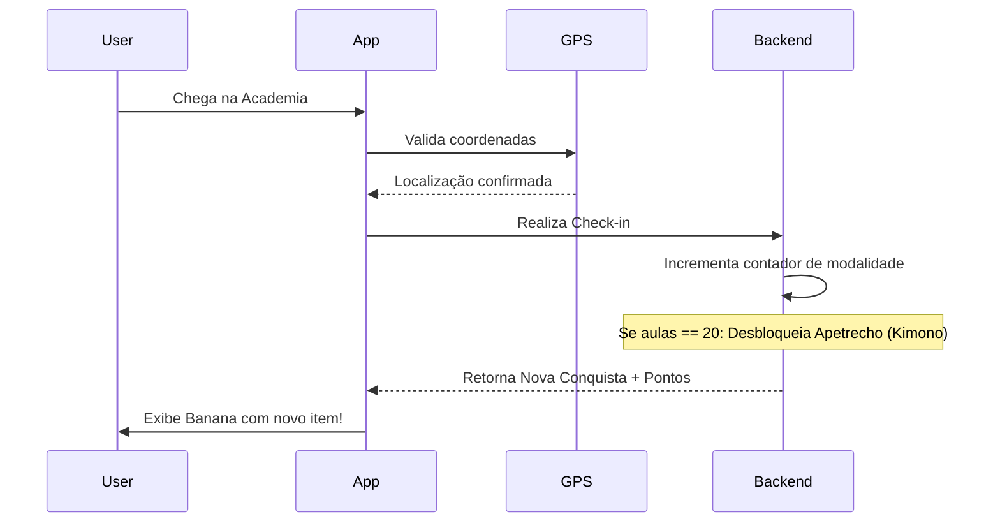

# 🍌 Banana Buddy: Documentação de Produto e Arquitetura

> **Transformando o suor em diversão através da gamificação 3D e Realidade Aumentada.**

---

## 📌 Sumário

1.  [Visão Geral](#1-visão-geral)
2.  [Requisitos do Produto (PRD)](#2-requisitos-prd)
3.  [Estratégia de Monetização e Engajamento](#3-estratégia-de-monetização-e-engajamento)
4.  [Arquitetura do Sistema](#4-arquitetura)
5.  [Fluxos de Processos](#5-fluxos)
6.  [Inteligência Artificial e Modelos](#6-modelos--ia)
7.  [Modelagem de Dados](#7-base-de-dados-prevista)
8.  [Decisões Técnicas](#8-decisões-técnicas)
9.  [Análise de Riscos](#9-riscos)
10. [Roadmap e Expansão (B2B)](#10-roadmap-e-expansão-b2b)

---

## 1. Visão Geral

### 💡 O Problema
O mercado de fitness sofre com o "churn" (abandono) de usuários após os primeiros 30 dias. Aplicativos tradicionais focam em dados frios (gráficos e calorias), falhando em criar um laço emocional que sustente a disciplina no longo prazo.

### 🚀 A Solução: Banana Buddy
O Banana Buddy humaniza o progresso através de um **avatar 3D interativo** cujo estado biológico é um espelho direto da saúde do usuário. Não é apenas um tracker, é um compromisso de "sobrevivência" visual e social.

---

## 2. Requisitos (PRD)

### ✅ Funcionais
*   **Renderização Interativa 3D:** Avatar dinâmico com suporte a gestos e reações.
*   **Sistema de Estados Evolutivos:** Ciclo visual de "Reluzente" a "Podre" baseado em atividade real.
*   **Check-in por Geolocalização:** Validação presencial em locais de treino para garantir a integridade da atividade física.
*   **Apetrechos por Conquista (Mérito):** Desbloqueio de itens funcionais (Kimonos, Luvas de Boxe, Toucas) ao atingir marcos de treino (ex: 20 aulas de Jiu-Jitsu).
*   **Bananeiras (Clãs):** Ecossistema social para competição em grupos e vigilância mútua.
*   **Integração de Saúde:** Sincronização híbrida (Apple Health, Google Fit e Strava).

### ⚙️ Não Funcionais
*   **Escalabilidade:** Backend preparado para alta concorrência em rankings globais.
*   **Integridade:** Detecção de fraude via GPS e sensores biométricos.
*   **UX de Baixa Fricção:** Sincronização passiva em background.

---

## 3. Estratégia de Monetização e Engajamento

O Banana Buddy utiliza um modelo **Freemium Progressivo**:

*   **🏆 Sistema de Mérito (Grátis):** O usuário ganha o *direito* de usar um acessório (Ex: Kimono de Judo) através do esforço. Isso gera retenção e orgulho.
*   **💎 Customização Exclusiva (Pago):** Enquanto o acessório é conquistado, a **personalização estética** (cores raras, skins de luxo, efeitos de brilho) é comercializada via microtransações ou assinatura Gold.
*   **🛡️ Itens de Proteção (Consumíveis):** Venda de "Escudos de Streak" para proteger a banana em períodos de viagem ou descanso planejado.

---

## 4. Arquitetura

### 📊 Diagrama de Arquitetura (Mermaid)

---

## 5. Fluxos de Processos

### 📍 Fluxo de Check-in e Evolução

---

## 6. Modelos / IA (Integridade do Dados)

Para ser atrativo a compradores e investidores, o sistema possui uma camada de **Anti-Cheat**:
*   **Validação Cruzada:** Cruza dados de GPS (movimentação) com Frequência Cardíaca para evitar check-ins falsos.
*   **Detecção de Anomalia:** Bloqueia registros humanos impossíveis (ex: estar em duas academias em 5 minutos).

---

## 7. Modelagem de Dados (PREVISTA)

| Tabela | Atributo Chave | Finalidade |
| :--- | :--- | :--- |
| `Achievements` | `requirement_met` | Controla o desbloqueio gratuito de apetrechos. |
| `Skins_Inventory` | `is_premium` | Diferencia itens conquistados de itens comprados. |
| `Locations` | `lat_long_radius` | Lista de geofences para check-ins validados. |
| `Transactions` | `payment_status` | Rastreabilidade de compras de skins e moedas. |

---

## 8. Decisões Técnicas

*   **React Native + Expo:** Escolhido pela versatilidade de integração com APIs de GPS e HealthKit em ambas as plataformas.
*   **Geofencing Dinâmico:** Implementação de perímetros virtuais em torno de parceiros para automação de check-ins.

---

## 9. Análise de Riscos

| Risco | Impacto | Estratégia de Mitigação |
| :--- | :--- | :--- |
| **Burlar GPS** | Alto | Uso de APIs nativas de "Location Spoofing Detection". |
| **Monetização Agressiva** | Médio | Manter o "Core Loop" acessível apenas via esforço físico (Play-to-Earn). |

---

## 10. Roadmap e Expansão (B2B)

### 🚀 Fase 1: MVP Social (Atual)
Foco no B2C, gamificação e sistema de skins pagas.

### 🏢 Fase 2: Conveniado (B2B) - **O Grande Salto**
*   **Parcerias com Academias:** Academias conveniadas oferecem "Skins de Edição Limitada" para quem treinar em suas unidades.
*   **Plataforma de Dados:** Fornecer dashboards anônimos de engajamento para donos de academias (SaaS).
*   **Marketplace de Suplementos:** Integração de e-commerce de parceiros dentro do inventário da banana.

---

> *Documentação estratégica para o projeto Banana Buddy - Ibmec 2026.1*
